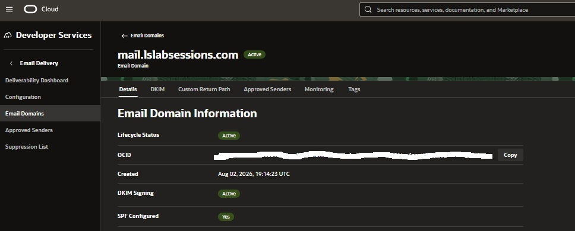
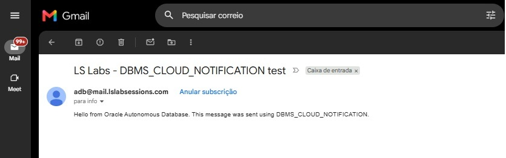
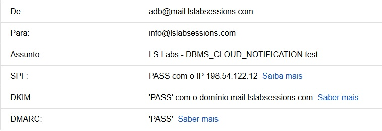
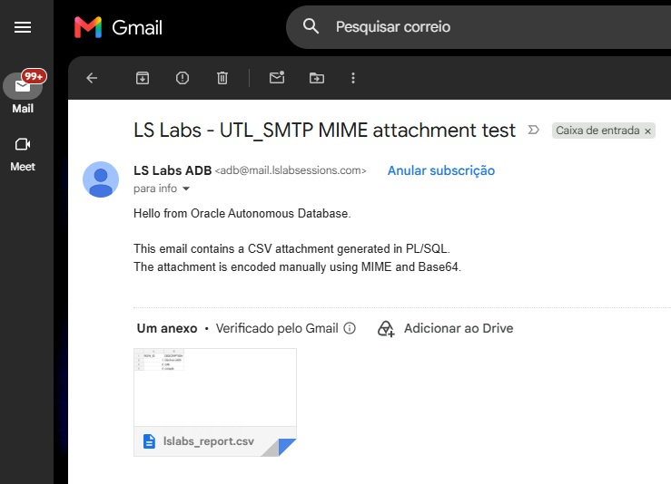

# Secure Email Delivery from Oracle Autonomous Database with UTL_SMTP and DBMS_CLOUD_NOTIFICATION

This repository explores how to send authenticated email from Oracle Autonomous Database using Oracle Cloud Infrastructure (OCI) Email Delivery.

The project starts with the infrastructure required to send mail from a domain we control and then moves into the PL/SQL implementation.

Two PL/SQL approaches are compared:

- `DBMS_CLOUD_NOTIFICATION`, a higher-level package that can send messages and SQL query results through supported providers, including email;
- `UTL_SMTP`, a lower-level SMTP API that exposes the SMTP conversation and gives the application direct control over recipients, message headers, MIME content, character encoding, and attachments.

The lab also compares two SMTP authentication patterns with `UTL_SMTP`.

The first example deliberately uses the SMTP username and password directly with `UTL_SMTP.AUTH`. This demonstrates that direct authentication is technically possible, but it also shows the security problem: reusable credentials have to be supplied to the PL/SQL code.

The second approach stores those credentials in a database credential object created with `DBMS_CLOUD.CREATE_CREDENTIAL` and authenticates with `UTL_SMTP.SET_CREDENTIAL`. The sending code now refers to a credential name instead of receiving the reusable SMTP username and password directly.

The goal is not only to send an email successfully. It is to understand what happens between PL/SQL and the recipient's inbox, and where authentication, TLS, SMTP, RFC 5322 headers, MIME, UTF-8, Base64, SPF, DKIM, DMARC, and deliverability fit into that flow.

---

## What is OCI Email Delivery?

OCI Email Delivery is a managed outbound email service provided by Oracle Cloud Infrastructure.

Instead of installing, configuring, and maintaining our own SMTP server, an application can submit outgoing messages to the SMTP service provided by OCI.

In this lab, Oracle Autonomous Database connects to the regional OCI Email Delivery SMTP endpoint:

```text
smtp.email.eu-frankfurt-1.oci.oraclecloud.com
```

using port `587` and `STARTTLS`.

The simplified flow is:

```text
Oracle Autonomous Database
        ↓
SMTP + STARTTLS
        ↓
OCI Email Delivery
        ↓
Internet mail infrastructure
        ↓
Gmail / Outlook / other recipient
```

OCI Email Delivery therefore acts as the managed outbound mail service between the database and the recipient's mail system.

It is not a mailbox and it does not receive email for our domain.

### Sending email from our own domain

For this lab, we want the messages sent by Autonomous Database to use an address from a domain that we control, for example:

```text
From: adb@mail.lslabsessions.com
```

The domain lslabsessions.com was therefore acquired for the LS Lab Sessions environment and is managed through Namecheap. A dedicated subdomain was created for outbound email:

```text
mail.lslabsessions.com
```

Autonomous Database creates and submits the message to OCI Email Delivery.

OCI Email Delivery then sends the message on behalf of the configured sending domain:

```text
Oracle Autonomous Database
        │
        │ submits the message
        ▼
OCI Email Delivery
        │
        │ sends on behalf of
        │ mail.lslabsessions.com
        ▼
Recipient mail system
```

This requires more than just an SMTP username and password.

Different parts of the configuration solve different problems:

```text
SMTP credentials
    → authenticate the client connecting to OCI Email Delivery

IAM policy
    → authorize the OCI identity to use Email Delivery

Email Domain / Approved Sender
    → authorize the sending identity in OCI Email Delivery

SPF / DKIM / DMARC
    → allow receiving mail systems to validate messages
      sent on behalf of the domain
```

The important point is that Autonomous Database is not acting as its own Internet mail server.

It creates the message and submits it through SMTP, while OCI Email Delivery provides the managed outbound mail infrastructure that delivers the message on behalf of the configured domain.

---

## What is DBMS_CLOUD_NOTIFICATION?

`DBMS_CLOUD_NOTIFICATION` is an Oracle package that provides a higher-level interface for sending notifications from the database.

For the email provider, the package can send a text message with `SEND_MESSAGE` or send SQL query output with `SEND_DATA`.

Instead of manually implementing an SMTP conversation such as:

```text
EHLO
STARTTLS
AUTH
MAIL FROM
RCPT TO
DATA
QUIT
```

the application calls procedures such as:

```sql
DBMS_CLOUD_NOTIFICATION.SEND_MESSAGE
```

or:

```sql
DBMS_CLOUD_NOTIFICATION.SEND_DATA
```

and supplies values such as the credential name, SMTP host, sender, recipients, and subject.

This is the higher-level path in the project. `UTL_SMTP` is the lower-level path where the application controls the SMTP and message structure directly.

---

## Why a custom domain is part of the lab

Sending email involves more than an SMTP username and password.

For this project, the domain:

```text
lslabsessions.com
```

was acquired for the LS Lab Sessions environment.

The root domain is also used for inbound email forwarding:

```text
info@lslabsessions.com
        ↓
email forwarding
        ↓
receiving mailbox
```

For outbound email from Autonomous Database, the lab uses a dedicated sending subdomain:

```text
mail.lslabsessions.com
```

Example senders are:

```text
adb@mail.lslabsessions.com
reports@mail.lslabsessions.com
```

Using a dedicated sending subdomain keeps the OCI Email Delivery DNS configuration separate from the root domain and its existing forwarding configuration.

The DNS provider used in this lab is Namecheap, but the same concepts apply with another DNS provider.

---

## What was configured in OCI

The lab does not begin in PL/SQL.

Before Autonomous Database can send authenticated mail through OCI Email Delivery, the OCI-side configuration has to be prepared.

The project uses:

```text
OCI compartment
    ↓
Email Domain
    ↓
DKIM
    ↓
Approved Sender
    ↓
IAM group
    ↓
IAM service user
    ↓
IAM policy
    ↓
SMTP credentials
```

For this lab:

```text
OCI region:
eu-frankfurt-1

Email Domain:
mail.lslabsessions.com

Approved Sender:
@mail.lslabsessions.com

SMTP endpoint:
smtp.email.eu-frankfurt-1.oci.oraclecloud.com
```

The SMTP credentials belong to a dedicated IAM service user used by the database to authenticate with OCI Email Delivery.

The OCI setup is described in more detail in [`docs/oci-email-delivery-setup.md`](docs/oci-email-delivery-setup.md).

---

## What was configured in DNS

Creating the Email Domain in OCI is only part of the setup.

The public DNS configuration also allows receiving mail systems to authenticate messages sent for the domain.

The lab configures:

```text
SPF
DKIM
DMARC
```

The final received messages were validated with:

```text
SPF   PASS
DKIM  PASS
DMARC PASS
```

These mechanisms solve a different problem from the SMTP credentials.

```text
SMTP credentials
    ↓
Authenticate the client connecting to OCI Email Delivery

IAM policy
    ↓
Authorize the OCI identity to use Email Delivery

Approved Sender
    ↓
Authorize the sending identity/domain in OCI Email Delivery

SPF / DKIM / DMARC
    ↓
Allow receiving mail systems to authenticate the sending domain
```

The DNS setup is described in [`docs/dns-authentication.md`](docs/dns-authentication.md).

---

## Why this matters

At first sight, sending an email from PL/SQL can look as simple as:

```sql
UTL_SMTP.AUTH(
    l_connection,
    '<SMTP_USERNAME>',
    '<SMTP_PASSWORD>',
    schemes => 'PLAIN'
);
```

And it can work.

One example in this repository deliberately uses this approach so that both authentication models can be compared.

The problem is not that `UTL_SMTP.AUTH` cannot authenticate successfully. The problem is how reusable credentials are handled.

If the username and password are supplied directly to application PL/SQL, they can accidentally appear in:

- source files;
- deployment scripts;
- SQL history;
- screenshots;
- logs;
- source-control repositories.

The repository therefore demonstrates direct authentication first and then replaces it with a database credential object:

```sql
BEGIN
    DBMS_CLOUD.CREATE_CREDENTIAL(
        credential_name => 'LSLABS_EMAIL_CRED',
        username        => '<SMTP_USERNAME>',
        password        => '<SMTP_PASSWORD>'
    );
END;
/
```

The application can then authenticate with:

```sql
UTL_SMTP.SET_CREDENTIAL(
    l_connection,
    'LSLABS_EMAIL_CRED',
    schemes => 'PLAIN'
);
```

The email-sending code knows the credential name, but it does not need to receive the reusable SMTP username and password directly.

The same database credential object can also be referenced by `DBMS_CLOUD_NOTIFICATION`.

This gives three useful cases to compare:

```text
UTL_SMTP.AUTH
    ↓
SMTP username/password supplied directly
    ↓
Works, but reusable secrets reach the PL/SQL call

UTL_SMTP.SET_CREDENTIAL
    ↓
Database credential name
    ↓
Reusable SMTP secrets remain in the credential object

DBMS_CLOUD_NOTIFICATION
    ↓
Database credential name
    ↓
Higher-level email API
```

---

## A simple mental model

The complete lab can be viewed as several independent layers:

```text
DOMAIN
mail.lslabsessions.com
        │
        ├── SPF
        ├── DKIM
        └── DMARC
        │
        v
OCI EMAIL DELIVERY
        │
        ├── Email Domain
        ├── Approved Sender
        ├── IAM authorization
        └── SMTP credentials
        │
        v
AUTONOMOUS DATABASE
        │
        ├── network ACE
        ├── DBMS_CLOUD credential
        │
        ├── DBMS_CLOUD_NOTIFICATION
        │             OR
        └── UTL_SMTP
                │
                ├── STARTTLS
                ├── AUTH / SET_CREDENTIAL
                ├── SMTP envelope
                ├── RFC 5322 headers
                └── MIME
                        │
                        v
                    RECIPIENT
```

Each layer solves a different problem. That distinction is important throughout the project.

---

## Lab architecture

```text
                    DNS
        mail.lslabsessions.com
          │       │       │
         SPF     DKIM    DMARC
          │       │       │
          └───────┬───────┘
                  │
                  v
       OCI Email Delivery
          eu-frankfurt-1
                  ▲
                  │
          SMTP / STARTTLS
             port 587
                  │
        ┌─────────┴─────────┐
        │                   │
DBMS_CLOUD_NOTIFICATION   UTL_SMTP
        │                   │
        │             AUTH
        │               or
        │          SET_CREDENTIAL
        │                   │
        └─────────┬─────────┘
                  │
       Oracle Autonomous
           Database
                  │
                  v
          External recipients
        Gmail / Outlook / etc.
```

A more detailed explanation is available in [`docs/architecture.md`](docs/architecture.md).

---

## What this repository demonstrates

### 1. OCI Email Delivery and domain configuration

The infrastructure and DNS configuration includes:

- a dedicated Email Domain;
- DKIM signing;
- a domain-level Approved Sender;
- a dedicated IAM service user and group;
- an Email Delivery IAM policy;
- SMTP credentials;
- SPF and DMARC DNS records.

See:

```text
docs/oci-email-delivery-setup.md
docs/dns-authentication.md
```

The PL/SQL examples assume that this configuration is already in place.

### 2. SMTP network access from Autonomous Database

Creating an SMTP credential does not grant the database permission to connect to the SMTP host.

The application schema also requires an Access Control Entry for the SMTP endpoint and port.

The lab restricts SMTP access to:

```text
smtp.email.eu-frankfurt-1.oci.oraclecloud.com
TCP port 587
SMTP privilege
```

Run:

```text
sql/001_configure_network_ace.sql
```

### 3. Database credential for SMTP authentication

Run:

```text
sql/002_create_smtp_credential.sql
```

The public repository should contain placeholders only:

```text
<SMTP_USERNAME>
<SMTP_PASSWORD>
```

The credential object used by the examples is:

```text
LSLABS_EMAIL_CRED
```

Real SMTP credentials must never be committed to Git.

---

## DBMS_CLOUD_NOTIFICATION

### 4. Send a simple message

Run:

```text
sql/005_dbms_cloud_notification_message.sql
```

The example uses:

```sql
DBMS_CLOUD_NOTIFICATION.SEND_MESSAGE
```

The procedure receives the credential name and email parameters such as:

```text
sender
smtp_host
subject
recipient
```

The application does not have to manually implement the SMTP conversation or construct the RFC message itself.

```text
Autonomous Database
    ↓
DBMS_CLOUD_NOTIFICATION
    ↓
OCI Email Delivery
    ↓
Recipient
```

### 5. Send SQL query results as an attachment

Run:

```text
sql/010_dbms_cloud_notification_data.sql
```

This example uses:

```sql
DBMS_CLOUD_NOTIFICATION.SEND_DATA
```

`SEND_DATA` executes a SQL query and sends its output using a supported format such as CSV or JSON.

```text
SQL query
    ↓
DBMS_CLOUD_NOTIFICATION
    ↓
CSV / JSON
    ↓
Email attachment
```

This is much simpler than constructing a MIME attachment manually with `UTL_SMTP`.

The Oracle documentation currently states a 32 KB maximum message size for `SEND_DATA` with the email provider, so this API should be evaluated against the expected result size.

### 6. CC, BCC, and UTF-8

Run:

```text
sql/035_dbms_cloud_notification_cc_bcc_utf8.sql
```

For email, `DBMS_CLOUD_NOTIFICATION` supports parameters for:

```text
recipient
to_cc
to_bcc
```

The test message also includes Unicode characters such as:

```text
Olá
acentuação
coração
café
€
```

This verifies the behavior of the higher-level API with Unicode text without the application manually constructing the MIME character-set headers.

A BCC-related observation found during testing is documented in [`docs/troubleshooting.md`](docs/troubleshooting.md). It is kept as an observation under verification rather than being presented as general product behavior.

---

## UTL_SMTP

### 7. Direct SMTP authentication with AUTH

Run:

```text
sql/012_utl_smtp_auth_demo.sql
```

This example deliberately passes the SMTP username and password directly:

```sql
UTL_SMTP.AUTH(
    l_connection,
    '<SMTP_USERNAME>',
    '<SMTP_PASSWORD>',
    schemes => 'PLAIN'
);
```

It exists to demonstrate the direct authentication model and provide a baseline for comparison.

The real values must only be used in a local copy, for example:

```text
012_utl_smtp_auth_demo.local.sql
```

A `.gitignore` rule should prevent `*.local.sql` files from being committed.

`PLAIN` describes the SMTP authentication mechanism. In this project, authentication is performed only after `STARTTLS`, so the SMTP session is already protected by TLS.

### 8. Authentication with a stored credential

Run:

```text
sql/015_utl_smtp_set_credential.sql
```

The next example replaces the username/password parameters with:

```sql
UTL_SMTP.SET_CREDENTIAL(
    l_connection,
    'LSLABS_EMAIL_CRED',
    schemes => 'PLAIN'
);
```

The SMTP sequence is:

```text
OPEN_CONNECTION
      ↓
EHLO
      ↓
STARTTLS
      ↓
EHLO
      ↓
SET_CREDENTIAL
      ↓
MAIL
      ↓
RCPT
      ↓
DATA
      ↓
QUIT
```

The second `EHLO` is intentional. After the TLS upgrade, the client obtains the SMTP capabilities again before authentication.

### 9. SMTP envelope versus message headers

SMTP delivery information and visible message headers are not the same thing.

The SMTP envelope uses:

```text
MAIL FROM
RCPT TO
```

Inside the `DATA` section, the message contains headers such as:

```text
Date:
Message-ID:
From:
To:
Cc:
Subject:
```

This distinction becomes especially important for BCC.

### 10. UTF-8 and WRITE_RAW_DATA

Run:

```text
sql/025_utl_smtp_html_utf8.sql
```

`UTL_SMTP.WRITE_DATA` is appropriate for ASCII-safe headers and content, but Oracle documents that text written through this interface is converted to US7ASCII.

For direct multibyte content, the example converts the text to UTF-8 bytes:

```sql
UTL_I18N.STRING_TO_RAW(
    l_html,
    'AL32UTF8'
)
```

and writes those bytes with:

```sql
UTL_SMTP.WRITE_RAW_DATA
```

The MIME headers declare:

```text
Content-Type: text/html; charset=UTF-8
Content-Transfer-Encoding: 8bit
```

The test verifies characters such as:

```text
á
ç
ã
€
```

### 11. TO, CC, and BCC

Run:

```text
sql/030_utl_smtp_cc_bcc.sql
```

All actual recipients are supplied to the SMTP server using `RCPT`:

```text
RCPT → TO recipient
RCPT → CC recipient
RCPT → BCC recipient
```

The visible message contains:

```text
To:
Cc:
```

but deliberately does not contain a `Bcc:` header.

```text
SMTP envelope
    knows the BCC recipient

Message headers
    do not expose the BCC recipient
```

This example makes the difference between SMTP delivery and RFC message headers visible.

### 12. MIME attachment and Base64

Run:

```text
sql/040_utl_smtp_attachment_mime.sql
```

This is the most complete `UTL_SMTP` example in the repository.

The message is built as:

```text
multipart/mixed
│
├── text/plain; charset=UTF-8
│
└── text/csv; charset=UTF-8
    Content-Disposition: attachment
    Content-Transfer-Encoding: base64
```

A MIME boundary separates the body from the attachment:

```text
--LSLABS_BOUNDARY
Content-Type: text/plain; charset=UTF-8

Message body

--LSLABS_BOUNDARY
Content-Type: text/csv; charset=UTF-8
Content-Disposition: attachment; filename="lslabs_report.csv"
Content-Transfer-Encoding: base64

<Base64 data>

--LSLABS_BOUNDARY--
```

The attachment conversion path is:

```text
Text
  ↓
UTF-8 bytes
  ↓
Base64
  ↓
ASCII-safe representation
  ↓
SMTP
  ↓
Base64 decode
  ↓
Original UTF-8 bytes
  ↓
CSV text
```

The important distinction is:

```text
UTF-8
    defines how characters are represented as bytes

Base64
    defines how those bytes are represented for transport
```

The MIME Base64 output is wrapped into lines no longer than 76 characters.

More detail is available in [`docs/smtp-mime-notes.md`](docs/smtp-mime-notes.md).

---

## MIME multipart structures

The attachment example uses `multipart/mixed` because the body and attachment are different parts that belong to the same message:

```text
multipart/mixed
├── message body
└── attachment
```

`multipart/alternative` has a different purpose. It represents alternative versions of the same content:

```text
multipart/alternative
├── text/plain
└── text/html
```

A more complete message can nest them:

```text
multipart/mixed
│
├── multipart/alternative
│   ├── text/plain
│   └── text/html
│
└── attachment.csv
```

Each nested multipart uses its own boundary.

---

## DBMS_CLOUD_NOTIFICATION versus UTL_SMTP

| Capability | `DBMS_CLOUD_NOTIFICATION` | `UTL_SMTP` |
|---|---|---|
| API level | Higher-level | Lower-level |
| SMTP conversation | Managed by the package | Application controlled |
| Database credential | Yes | Yes with `SET_CREDENTIAL` |
| Direct username/password | Not required by the send call | Possible with `AUTH` |
| STARTTLS handling | Abstracted | Explicit |
| TO / CC / BCC | Parameters | `RCPT` + message headers |
| Query-result attachment | `SEND_DATA` | Manual |
| Arbitrary MIME construction | Not exposed by this API | Full application control |
| UTF-8 handling | Managed by the higher-level implementation | Explicit byte handling available |
| Date / Message-ID control | Generated by implementation | Application controlled |
| Manual attachment | Not the main purpose of `SEND_MESSAGE` | MIME + Base64 |
| Complexity | Lower | Higher |
| Protocol visibility | Lower | Higher |

`DBMS_CLOUD_NOTIFICATION` is convenient when the required operation matches the abstraction it provides.

`UTL_SMTP` is useful when the application requires direct control over the email format or when understanding and controlling the SMTP and MIME layers is important.

A security-focused comparison is available in [`docs/security-comparison.md`](docs/security-comparison.md).

---

## Email-domain authentication

Successfully completing the SMTP transaction does not mean that the receiving system will automatically trust the message.

The lab therefore also validates:

```text
SPF
DKIM
DMARC
```

### SPF

SPF publishes which mail infrastructure is authorized to send for a domain.

It is not the mechanism used by Autonomous Database to log in to OCI Email Delivery.

### DKIM

OCI Email Delivery signs the outgoing message. The receiver validates the signature using public information published in DNS.

### DMARC

DMARC evaluates authenticated domain alignment with the domain visible in the message's `From:` header and publishes a policy for messages that fail DMARC evaluation.

The lab starts with:

```text
v=DMARC1; p=none;
```

so DMARC can be validated and monitored without asking receiving systems to quarantine or reject a message solely because it fails DMARC.

See [`docs/dns-authentication.md`](docs/dns-authentication.md).

---

## Authentication is not the same as deliverability

One useful result from the lab was that:

```text
SPF   PASS
DKIM  PASS
DMARC PASS
```

does not guarantee:

```text
Inbox
```

One Outlook test message was classified as Junk even though the authentication checks passed.

This is not contradictory. Authentication validates identity and domain-related signals. Spam filtering can also use reputation, sending history, message characteristics, and provider-specific filtering.

The observation is documented in [`docs/troubleshooting.md`](docs/troubleshooting.md).

---

## Prerequisites

Before running the SQL examples, the lab assumes:

- an Oracle Autonomous Database;
- a schema allowed to execute the required packages;
- an administrator able to manage database network ACLs;
- an OCI tenancy with Email Delivery available in the selected region;
- a domain or subdomain whose DNS records can be changed;
- an OCI Email Domain with DKIM active;
- an Approved Sender;
- an IAM identity authorized to use Email Delivery;
- generated SMTP credentials;
- the correct regional SMTP endpoint.

---

## Run order

### A. Configure the domain, OCI Email Delivery, and DNS

Follow:

```text
docs/oci-email-delivery-setup.md
docs/dns-authentication.md
```

Prepare:

```text
Email Domain
DKIM
Approved Sender
IAM service user
IAM group
IAM policy
SMTP credentials
SPF
DMARC
```

### B. Prepare Autonomous Database

Run with the required administrative privileges:

```text
sql/000_grant_required_packages.sql
sql/001_configure_network_ace.sql
```

### C. Create the database SMTP credential

Run as the application schema:

```text
sql/002_create_smtp_credential.sql
```

### D. Test DBMS_CLOUD_NOTIFICATION

Run:

```text
sql/005_dbms_cloud_notification_message.sql
sql/010_dbms_cloud_notification_data.sql
sql/035_dbms_cloud_notification_cc_bcc_utf8.sql
```

Expected results:

```text
Simple message       → delivered
Query result         → attachment received
UTF-8                → preserved
CC                   → visible recipient
BCC                  → recipient receives a copy
```

### E. Compare UTL_SMTP authentication

Run:

```text
sql/012_utl_smtp_auth_demo.sql
sql/015_utl_smtp_set_credential.sql
```

Both examples should authenticate successfully when configured correctly. The important difference is how the reusable SMTP credentials reach `UTL_SMTP`.

### F. Test message construction

Run:

```text
sql/025_utl_smtp_html_utf8.sql
sql/030_utl_smtp_cc_bcc.sql
sql/040_utl_smtp_attachment_mime.sql
```

Expected results:

```text
HTML UTF-8       → characters displayed correctly
CC / BCC         → envelope and message-header behavior demonstrated
MIME attachment  → CSV received and decoded correctly
```

### G. Validate the received messages

At the receiving provider, inspect the original message headers and verify the expected SPF, DKIM, and DMARC results.

Representative evidence can be stored under:

```text
docs/screenshots/
```

---

## Selected lab evidence

The repository includes screenshots from the real configuration and delivery tests. A few representative milestones are shown below; the complete curated set is under [`docs/screenshots/`](docs/screenshots/).

### OCI Email Domain authentication active



### DBMS_CLOUD_NOTIFICATION message delivered



### SPF, DKIM, and DMARC validation



### UTL_SMTP MIME attachment



## Troubleshooting observations

The project documents real issues encountered while building the lab instead of creating failures only for demonstration purposes.

The main observations include:

- a missing direct package grant before using `DBMS_CLOUD_NOTIFICATION`;
- an unexpected `Date` header influenced by `NLS_DATE_LANGUAGE`;
- DMARC changing from FAIL to PASS after the DNS record was added;
- messages reaching Spam or Junk even when SPF, DKIM, and DMARC passed;
- the difference between `WRITE_DATA` and `WRITE_RAW_DATA` for multibyte text;

See [`docs/troubleshooting.md`](docs/troubleshooting.md).

---

## Security notes

- Never commit real SMTP usernames or passwords.
- Never publish OCI console passwords, API keys, private keys, or other secrets.
- Use placeholders in public SQL examples.
- Keep local scripts containing secrets outside version control, for example with `*.local.sql`.
- Prefer `UTL_SMTP.SET_CREDENTIAL` when reusable SMTP credentials should not be passed directly to the sending PL/SQL code.
- Authenticate only after TLS has been established when using the `PLAIN` SMTP authentication mechanism.
- Restrict database network access to the required SMTP host and port.
- Use only the sending identities required by the application.
- Redact personal recipient addresses and sensitive OCI identifiers from screenshots.
- SMTP authentication and SPF/DKIM/DMARC solve different problems.
- Successful authentication does not guarantee inbox placement.

---

## Cleanup

This repository does not include an automatic cleanup script.

Cleanup is intentionally manual because the lab creates resources in different layers:

- the database credential object;
- the database network ACE;
- OCI SMTP credentials;
- the Approved Sender;
- the Email Domain and DKIM configuration;
- IAM resources and policies;
- public DNS records.

Remove only the resources that are no longer required, using an account with the appropriate privileges.

For example, a database administrator can remove the network ACE when SMTP access is no longer needed, while OCI and DNS resources should be removed from their respective management interfaces.

---

## Repository structure

```text
adb-secure-email-delivery/
├── README.md
├── LICENSE
├── .gitignore
│
├── sql/
│   ├── 000_grant_required_packages.sql
│   ├── 001_configure_network_ace.sql
│   ├── 002_create_smtp_credential.sql
│   ├── 005_dbms_cloud_notification_message.sql
│   ├── 010_dbms_cloud_notification_data.sql
│   ├── 012_utl_smtp_auth_demo.sql
│   ├── 015_utl_smtp_set_credential.sql
│   ├── 025_utl_smtp_html_utf8.sql
│   ├── 030_utl_smtp_cc_bcc.sql
│   ├── 035_dbms_cloud_notification_cc_bcc_utf8.sql
│   └── 040_utl_smtp_attachment_mime.sql
│
└── docs/
    ├── architecture.md
    ├── oci-email-delivery-setup.md
    ├── dns-authentication.md
    ├── smtp-mime-notes.md
    ├── security-comparison.md
    ├── troubleshooting.md
    └── screenshots/
        ├── 003-domain-active.jpg
        ├── 004-basicdns-enabled.jpg
        ├── 006-dns-before-oci-configuration.jpg
        ├── 007-email-forwarding-configured.jpg
        ├── 010-create-email-domain.jpg
        ├── 012-create-dkim-key.jpg
        ├── 013-dkim-dns-record-generated.jpg
        ├── 014-oci-spf-and-dkim-records.jpg
        ├── 015-dkim-active.jpg
        ├── 016-email-domain-authentication-active.jpg
        ├── 017-approved-domain-sender-active.jpg
        ├── 018-create-email-senders-group.jpg
        ├── 019-email-senders-group-created.jpg
        ├── 022-email-sender-policy-created.jpg
        ├── 023-smtp-credential-created.jpg
        ├── 025-dbms-cloud-notification-send-message.jpg
        ├── 030-dbms-cloud-notification-message.jpg
        ├── 035-email-authentication-results.jpg
        ├── 040-dbms-cloud-notification-send-data.jpg
        ├── 045-query-results-email.jpg
        ├── 050-query-results-csv.jpg
        ├── 055-utl-smtp-set-credential.jpg
        ├── 060-utl-smtp-set-credential-email-marked-spam.jpg
        ├── 065-utl-smtp-rfc-message-sent.jpg
        ├── 070-utl-smtp-rfc-message.jpg
        ├── 075-dmarc-dns-resolution.jpg
        ├── 080-dmarc-pass.jpg
        ├── 085-utl-smtp-auth-sent.jpg
        ├── 090-utl-smtp-auth-email.jpg
        ├── 095-utl-smtp-auth-authentication-results.jpg
        ├── 100-utl-smtp-html-utf8-sent.jpg
        ├── 105-utl-smtp-html-utf8-email.jpg
        ├── 110-utl-smtp-html-utf8-authentication.jpg
        ├── 115-utl-smtp-cc-bcc-email.jpg
        ├── 120-utl-smtp-bcc-hotmail-delivered.jpg
        ├── 125-outlook-bcc-authentication-results_pass.jpg
        ├── 130-outlook-bcc-authentication-results_SCL5.jpg
        ├── 135-dbms-cloud-notification-cc-bcc-utf8-sent.jpg
        ├── 140-dbms-cloud-notification-cc-bcc-utf8.jpg
        ├── 145-utl-smtp-mime-attachment.jpg
        └── 150-utl-smtp-csv-content.jpg
```

The SQL filenames preserve the sequence in which the lab examples were created and tested. The `docs` directory contains the infrastructure, protocol, security, and troubleshooting explanations so that the README can stay focused on the complete lab flow.

---

## Documentation references

### Oracle Autonomous Database

- [Send Email on Autonomous AI Database](https://docs.oracle.com/en-us/iaas/autonomous-database-serverless/doc/smtp-send-mail.html)
- [DBMS_CLOUD_NOTIFICATION Package](https://docs.oracle.com/en/cloud/paas/autonomous-database/serverless/adbsb/autonomous-dbms-cloud-notification.html)

### Oracle Database PL/SQL packages

- [UTL_SMTP](https://docs.oracle.com/en/database/oracle/oracle-database/26/arpls/UTL_SMTP.html)
- [UTL_I18N](https://docs.oracle.com/en/database/oracle/oracle-database/26/arpls/UTL_I18N.html)
- [UTL_ENCODE](https://docs.oracle.com/en/database/oracle/oracle-database/26/arpls/UTL_ENCODE.html)

### OCI Email Delivery

- [Overview of Email Delivery](https://docs.oracle.com/en-us/iaas/Content/Email/Concepts/overview.htm)
- [Getting Started with Email Delivery](https://docs.oracle.com/en-us/iaas/Content/Email/Reference/gettingstarted.htm)
- [Creating an Email Domain](https://docs.oracle.com/en-us/iaas/Content/Email/Reference/gettingstarted_topic-create-email-domain.htm)
- [Creating an Approved Sender](https://docs.oracle.com/en-us/iaas/Content/Email/Reference/gettingstarted_topic-Create_an_approved_sender.htm)
- [Configuring DKIM](https://docs.oracle.com/en-us/iaas/Content/Email/Tasks/configure-dkim-using-the-console.htm)
- [Configuring SPF](https://docs.oracle.com/en-us/iaas/Content/Email/Tasks/configurespf.htm)
- [Email Delivery Best Practices](https://docs.oracle.com/en-us/iaas/Content/Email/Reference/deliverabilitybestpractices_topic-bestpractices.htm)

### Email standards

- [RFC 5321 — Simple Mail Transfer Protocol](https://www.rfc-editor.org/info/rfc5321/)
- [RFC 5322 — Internet Message Format](https://www.rfc-editor.org/info/rfc5322/)
- [RFC 2045 — MIME Part One](https://www.rfc-editor.org/info/rfc2045/)
- [RFC 2046 — MIME Part Two](https://www.rfc-editor.org/info/rfc2046/)

---

## License

This project is licensed under the [MIT License](LICENSE).
