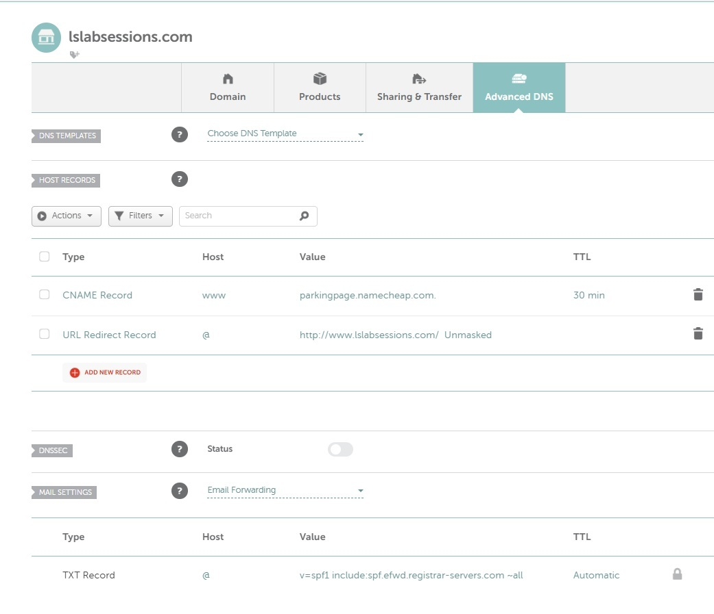
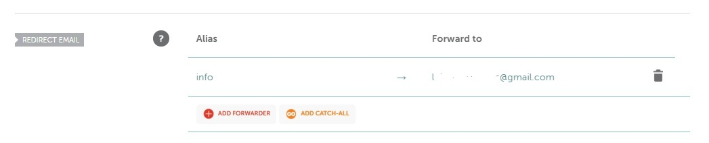
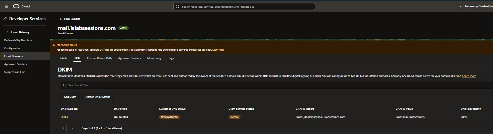
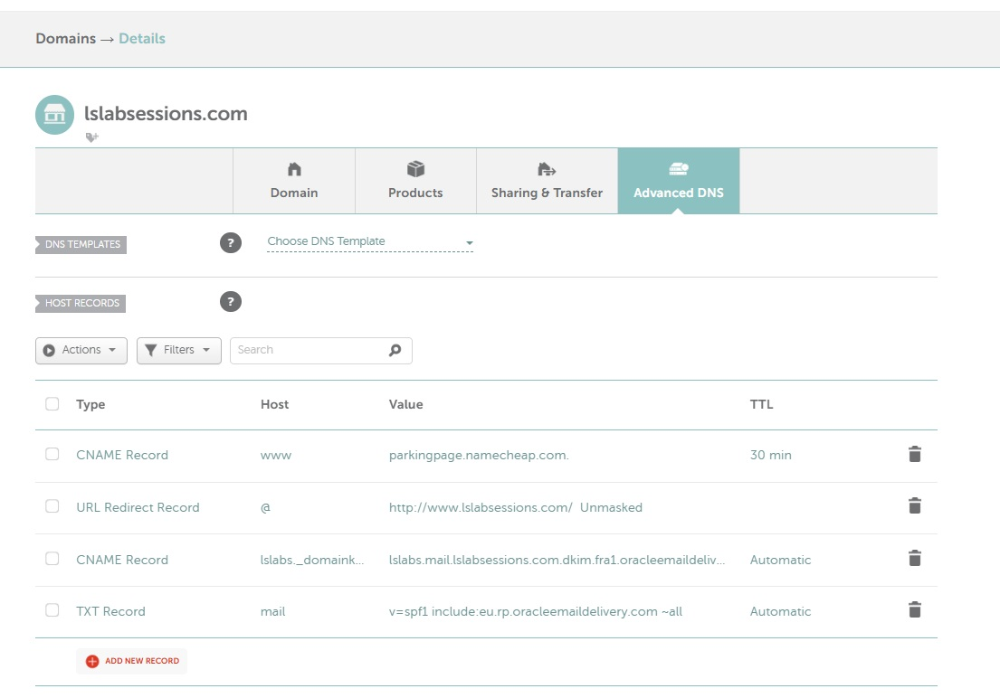
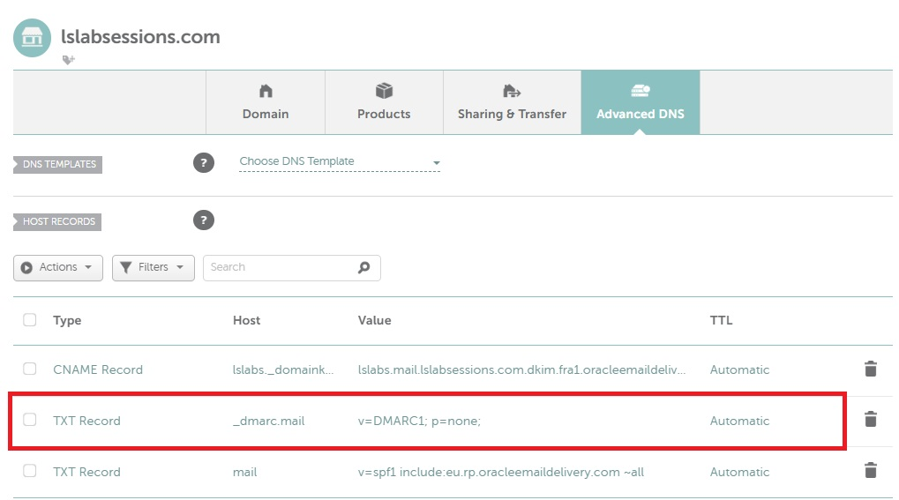

# DNS and email authentication

This document explains the DNS configuration used by the lab and how SPF, DKIM, and DMARC relate to OCI Email Delivery.

The most important point is that these DNS mechanisms do not replace the SMTP credentials used by Autonomous Database.

They are evaluated by receiving mail systems after the message has been submitted for delivery.

## Domain layout

The lab uses:

```text
Root domain:
lslabsessions.com

Outbound sending subdomain:
mail.lslabsessions.com
```

The root domain is also used for inbound forwarding, so the outbound Email Delivery configuration was placed on a separate subdomain.

This avoids mixing two different mail flows unnecessarily.

## SPF

SPF allows a domain owner to publish which sending infrastructure is authorized to send mail for a domain.

For the root domain, Namecheap forwarding already required its own SPF configuration.

The lab therefore keeps the OCI sending SPF on the dedicated subdomain.

The sending-subdomain SPF used in this environment is:

```text
Host: mail
Type: TXT
Value: v=spf1 include:eu.rp.oracleemaildelivery.com ~all
```

Use the Oracle-documented value appropriate to the sending region rather than copying a value from another region.

SPF does not authenticate Autonomous Database to OCI Email Delivery.

```text
SMTP username/password
    → client authentication to OCI Email Delivery

SPF
    → receiver checks whether the sending infrastructure is authorized by DNS
```

## DKIM

DKIM adds a cryptographic signature to the outgoing message.

For this lab, the Email Domain is:

```text
mail.lslabsessions.com
```

and the selector is:

```text
lslabs
```

OCI generates the DKIM CNAME target. The DNS record should be copied exactly from OCI.

Conceptually:

```text
lslabs._domainkey.mail.lslabsessions.com
    CNAME
<OCI-generated-target>
```

After DNS propagation, OCI reports the DKIM configuration as active.

Received messages can then show a successful DKIM result for the sending domain.

OCI Email Delivery can also add an infrastructure signature. Seeing more than one valid DKIM signature is therefore not necessarily an error.

## DMARC

DMARC evaluates alignment between the visible `From:` domain and authenticated SPF and/or DKIM identifiers.

For the sending subdomain, the lab publishes:

```text
Host: _dmarc.mail
Type: TXT
Value: v=DMARC1; p=none;
```

which resolves as:

```text
_dmarc.mail.lslabsessions.com
```

The policy:

```text
p=none
```

asks receivers to evaluate DMARC but does not request quarantine or rejection solely because of a DMARC failure.

This is a useful starting policy for a lab because it allows the authentication flow to be validated before considering stricter policies.

## Alignment in this lab

The visible sender is, for example:

```text
From: adb@mail.lslabsessions.com
```

and the customer DKIM signature uses:

```text
d=mail.lslabsessions.com
```

That provides direct DKIM alignment with the visible `From:` domain.

A receiving system can therefore evaluate DMARC successfully when the DKIM signature validates and aligns.

## Expected final result

After the DNS records propagated, test messages showed:

```text
SPF   PASS
DKIM  PASS
DMARC PASS
```

This validates the domain-authentication layer, but it does not guarantee Inbox placement.

Spam and reputation filters are separate from SPF, DKIM, and DMARC.

## Forwarding and SPF

Forwarding can make message authentication more interesting because the final receiver may see the forwarding server as the immediate SMTP sender.

The inbound address:

```text
info@lslabsessions.com
```

is forwarded by Namecheap to another mailbox.

That means a message sent to `info@lslabsessions.com` can follow this path:

```text
ADB
  ↓
OCI Email Delivery
  ↓
Namecheap forwarding
  ↓
final mailbox
```

while a direct CC to the same final mailbox follows:

```text
ADB
  ↓
OCI Email Delivery
  ↓
final mailbox
```

Those two copies can therefore contain different transport headers even when they originate from the same database send operation.

This distinction became important when analyzing duplicate messages and the BCC observation described in `troubleshooting.md`.

## DNS verification

DNS records can be checked with standard DNS tools.

For example, on PowerShell:

```powershell
Resolve-DnsName -Type TXT mail.lslabsessions.com
Resolve-DnsName -Type TXT _dmarc.mail.lslabsessions.com
Resolve-DnsName -Type CNAME lslabs._domainkey.mail.lslabsessions.com
```

The exact output depends on the DNS provider and propagation state.

## Keep these concepts separate

```text
SMTP credential
    → authenticates the SMTP client

IAM policy
    → authorizes the OCI identity

Approved Sender
    → authorizes the sending identity/domain in OCI Email Delivery

SPF
    → publishes authorized sending infrastructure

DKIM
    → cryptographically signs the message

DMARC
    → evaluates aligned authentication for the visible From domain
```

No single item replaces the others.

## Screenshot evidence

These screenshots show the DNS evolution from the initial Namecheap configuration to successful domain authentication.












## References

- [OCI Email Delivery Overview](https://docs.oracle.com/en-us/iaas/Content/Email/Concepts/overview.htm)
- [Configuring SPF](https://docs.oracle.com/en-us/iaas/Content/Email/Tasks/configurespf.htm)
- [Configuring DKIM](https://docs.oracle.com/en-us/iaas/Content/Email/Tasks/configure-dkim-using-the-console.htm)
- [Creating an Email Domain](https://docs.oracle.com/en-us/iaas/Content/Email/Reference/gettingstarted_topic-create-email-domain.htm)
- [Email Delivery Best Practices](https://docs.oracle.com/en-us/iaas/Content/Email/Reference/deliverabilitybestpractices_topic-bestpractices.htm)
