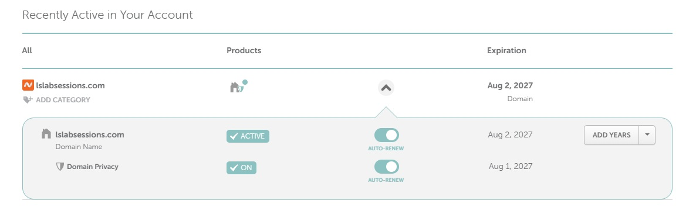
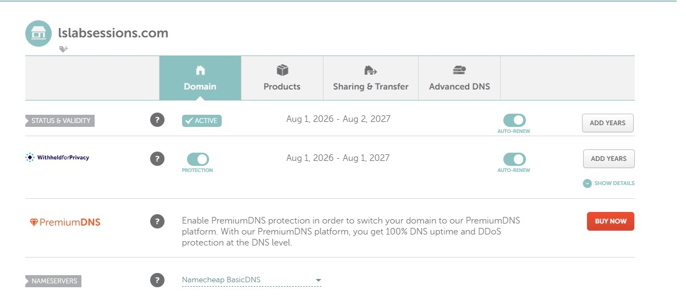
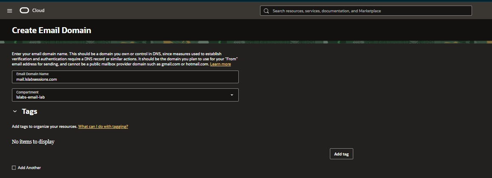
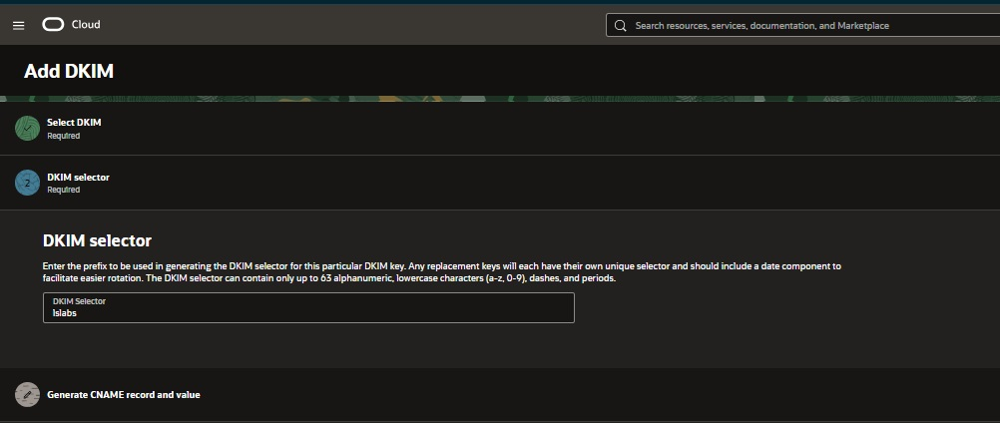
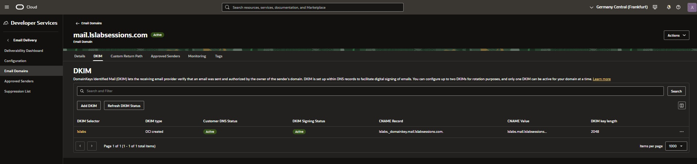
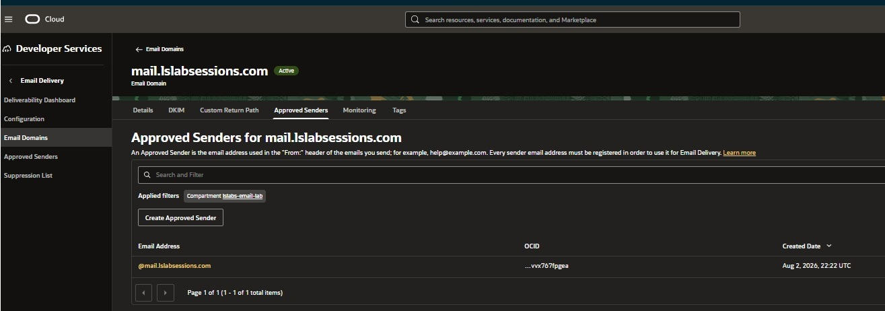
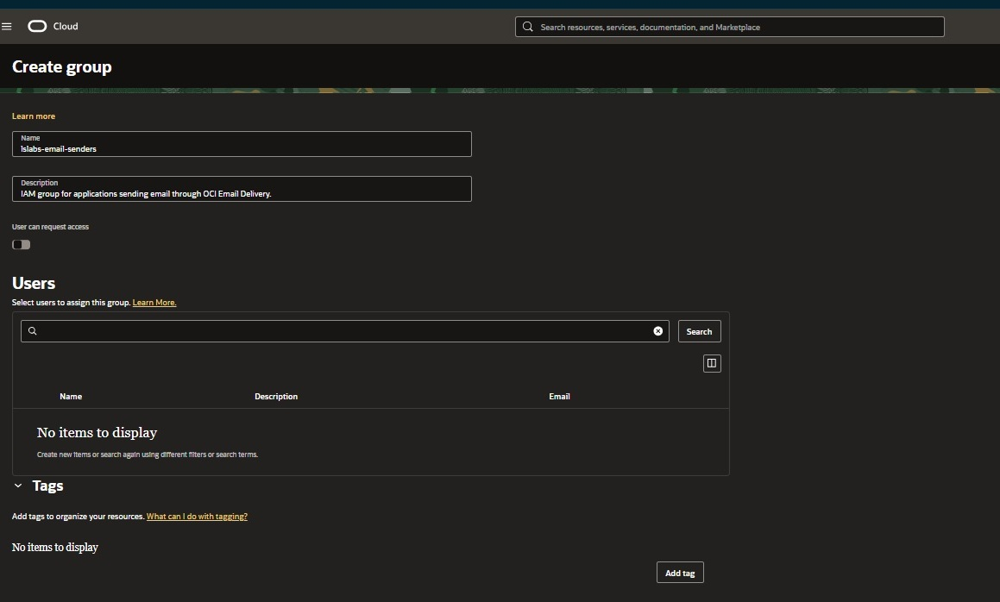
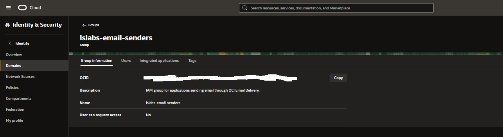
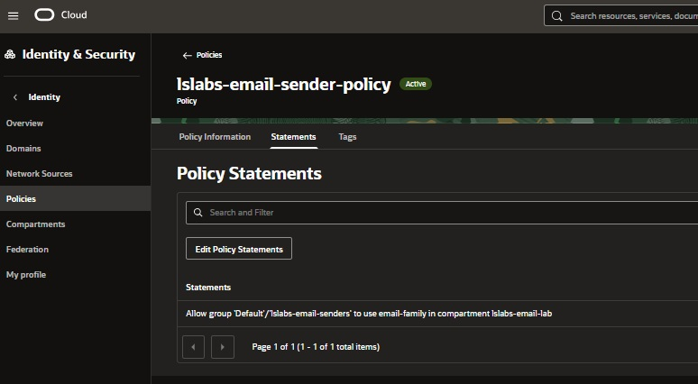
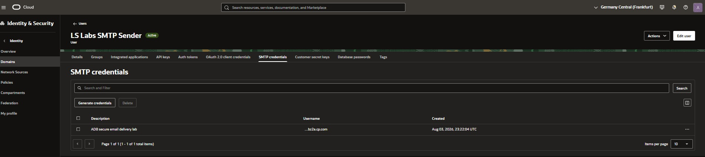

# OCI Email Delivery setup

This document describes the infrastructure prepared before the PL/SQL examples were executed.

The exact OCI console layout can change over time, but the resources and responsibilities remain the same.

## 1. Domain and sending-subdomain design

The project uses the domain:

```text
lslabsessions.com
```

and a dedicated outbound sending subdomain:

```text
mail.lslabsessions.com
```

The root domain is also used for inbound email forwarding, while `mail.lslabsessions.com` is dedicated to outbound email through OCI Email Delivery.

This gives a clear separation:

```text
Inbound
info@lslabsessions.com
    ↓
email forwarding

Outbound
adb@mail.lslabsessions.com
    ↓
OCI Email Delivery
```

The domain was acquired and its DNS is managed through Namecheap in this lab. Another DNS provider can be used as long as the required DNS records can be created.

## 2. OCI compartment

A dedicated compartment was used for the lab:

```text
lslabs-email-lab
```

Keeping the Email Delivery resources together makes the IAM policy and cleanup easier to understand.

## 3. Create the Email Domain

In the Frankfurt region, create an Email Domain for:

```text
mail.lslabsessions.com
```

OCI Email Domains provide the domain-level configuration used by Email Delivery.

At this point the domain exists in OCI, but DKIM still needs to be configured in public DNS.

## 4. Configure DKIM

Create a DKIM key for the Email Domain.

The selector used by this lab is:

```text
lslabs
```

OCI provides a CNAME name and target. Create that CNAME in the DNS provider exactly as shown by OCI.

Do not invent or shorten the generated target value.

Wait until the OCI console reports DKIM as active before continuing to the domain-level Approved Sender.

A typical conceptual record is:

```text
lslabs._domainkey.mail.lslabsessions.com
    CNAME
<OCI-generated-DKIM-target>
```

The exact target is generated by OCI and is intentionally not stored in this document.

## 5. Create the Approved Sender

After DKIM is active, create the domain-level Approved Sender:

```text
@mail.lslabsessions.com
```

This allows addresses under the sending domain to be used as approved `From:` identities, subject to the Email Delivery configuration.

Example senders used by the project are:

```text
adb@mail.lslabsessions.com
reports@mail.lslabsessions.com
```

OCI documentation notes that an Approved Sender is regional, so the sender and SMTP endpoint must be configured in the intended sending region.

## 6. Create a dedicated IAM group

Create a group for identities allowed to use Email Delivery.

The lab uses:

```text
lslabs-email-senders
```

A dedicated group keeps the Email Delivery permission separate from unrelated user permissions.

## 7. Create a dedicated IAM service user

Create a service user for SMTP sending.

The lab uses:

```text
lslabs-smtp-sender
```

This user is used for service authentication and does not need to be used as a normal interactive console account for the email flow.

Add the service user to the Email Delivery group.

## 8. Grant Email Delivery permission

Create an IAM policy that grants the Email Delivery group the required permission in the email lab compartment.

The exact group reference can vary depending on the OCI identity-domain configuration, so use the policy syntax appropriate to the tenancy.

Conceptually, the policy grants:

```text
lslabs-email-senders
    ↓
use Email Delivery resources
    ↓
lslabs-email-lab compartment
```

Keep the policy scoped to the compartment used by the lab where possible.

## 9. Generate SMTP credentials

Generate SMTP credentials for:

```text
lslabs-smtp-sender
```

OCI generates an SMTP username and password.

These values are secrets.

Do not include them in:

- GitHub;
- screenshots;
- README examples;
- SQL files committed to source control;
- logs.

The real values are stored in the Autonomous Database credential object later in the setup.

## 10. Identify the SMTP endpoint

The project uses the Frankfurt Email Delivery endpoint:

```text
smtp.email.eu-frankfurt-1.oci.oraclecloud.com
```

and port:

```text
587
```

The database connects using SMTP and upgrades the session with `STARTTLS` before authentication.

## 11. Configure Autonomous Database network access

The OCI Email Delivery setup does not automatically grant a database schema outbound network access.

The database administrator must create an Access Control Entry for the application schema, SMTP host, and port.

The repository configures this in:

```text
sql/001_configure_network_ace.sql
```

The network ACE and the SMTP credential solve different problems:

```text
Network ACE
    → may the schema connect to this SMTP host and port?

SMTP credential
    → can the client authenticate to OCI Email Delivery?
```

## 12. Create the database credential object

The public script uses placeholders:

```sql
BEGIN
    DBMS_CLOUD.CREATE_CREDENTIAL(
        credential_name => 'LSLABS_EMAIL_CRED',
        username        => '<SMTP_USERNAME>',
        password        => '<SMTP_PASSWORD>'
    );
END;
/
```

The real SMTP values should be supplied only in a controlled local execution context.

After creation, the sending code can refer to:

```text
LSLABS_EMAIL_CRED
```

instead of embedding the reusable SMTP password in each sending script.

## 13. Package privileges

The application schema also requires the necessary package privileges.

The repository keeps the required grants in:

```text
sql/000_grant_required_packages.sql
```

This is important because package visibility and network access are independent controls.

## Configuration checklist

Before running the email examples, verify:

```text
[ ] Email Domain exists in eu-frankfurt-1
[ ] DKIM is Active
[ ] Approved Sender exists
[ ] IAM service user exists
[ ] IAM service user is in the Email Delivery group
[ ] IAM policy grants the required Email Delivery access
[ ] SMTP credentials were generated
[ ] SMTP endpoint is correct for the region
[ ] Database package grants are present
[ ] Database network ACE allows SMTP to the endpoint on port 587
[ ] Database credential object exists
[ ] SPF is published
[ ] DMARC is published
```

## Security notes

- Treat SMTP credentials as secrets.
- Redact full OCI identifiers from public screenshots when they do not add value.
- Use a dedicated service identity instead of a personal interactive user for repeatable application sending.
- Keep IAM permissions scoped to the resources required by the lab.
- Remove network access and unused credentials after testing when they are no longer needed.

## Screenshot evidence

The following screenshots show the main OCI and domain-setup milestones used in this lab.

### Domain and DNS starting point





### OCI Email Domain and DKIM









### Approved Sender, IAM, and SMTP credentials











## References

- [Getting Started with OCI Email Delivery](https://docs.oracle.com/en-us/iaas/Content/Email/Reference/gettingstarted.htm)
- [Creating an Email Domain](https://docs.oracle.com/en-us/iaas/Content/Email/Reference/gettingstarted_topic-create-email-domain.htm)
- [Creating an Approved Sender](https://docs.oracle.com/en-us/iaas/Content/Email/Reference/gettingstarted_topic-Create_an_approved_sender.htm)
- [Configuring DKIM](https://docs.oracle.com/en-us/iaas/Content/Email/Tasks/configure-dkim-using-the-console.htm)
- [Send Email on Autonomous AI Database](https://docs.oracle.com/en-us/iaas/autonomous-database-serverless/doc/smtp-send-mail.html)
