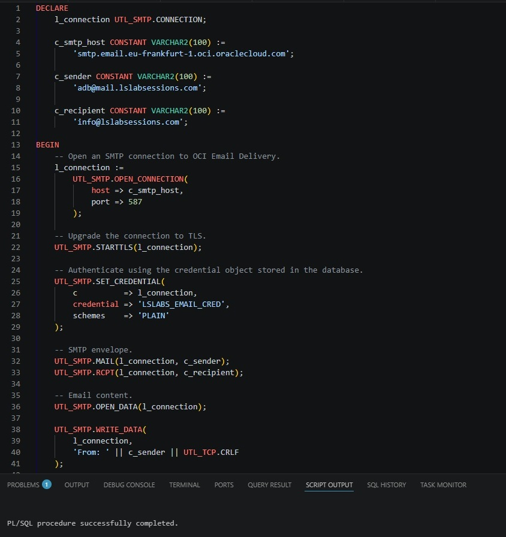
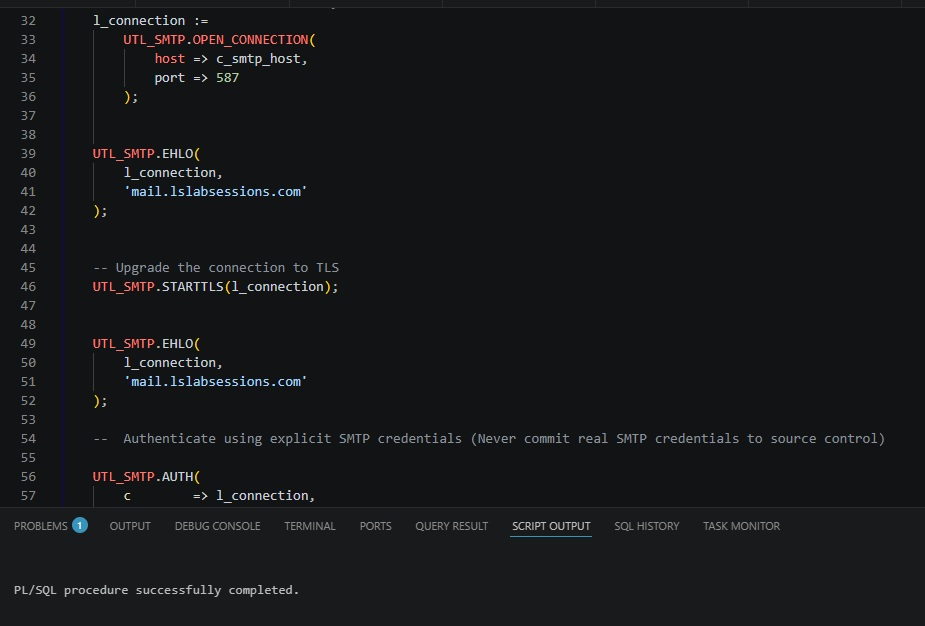
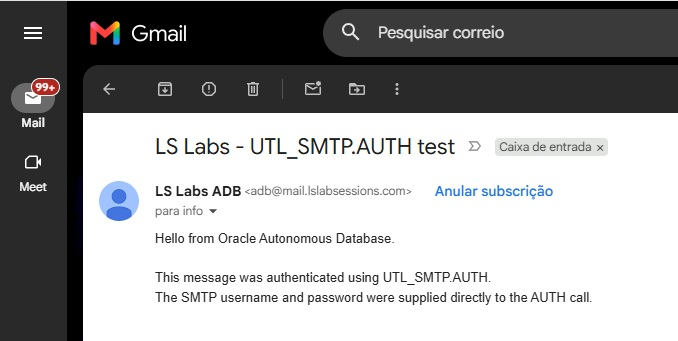
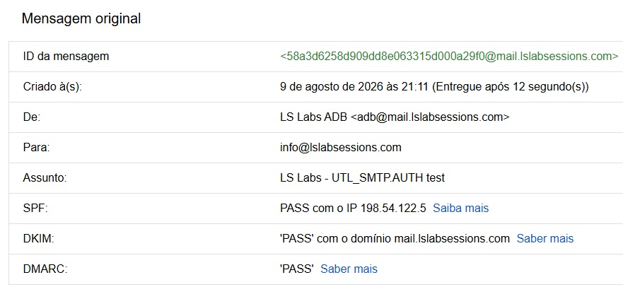

# Security comparison

This document compares the authentication and authorization mechanisms used by the lab.

The main lesson is that several controls are involved and each one protects a different boundary.

## UTL_SMTP.AUTH versus UTL_SMTP.SET_CREDENTIAL

Both mechanisms can authenticate an SMTP session.

The difference is how the reusable username and password reach the SMTP package.

### Direct AUTH

```sql
UTL_SMTP.AUTH(
    l_connection,
    '<SMTP_USERNAME>',
    '<SMTP_PASSWORD>',
    schemes => 'PLAIN'
);
```

This is useful as a technical demonstration because it makes the SMTP authentication inputs explicit.

However, the application or script must now supply the reusable credentials directly.

Possible exposure points include:

- source code;
- deployment scripts;
- SQL history;
- code reviews;
- screenshots;
- logs;
- source-control repositories.

The project therefore keeps the real `AUTH` version only as a local test and publishes placeholders in Git.

### Stored credential

Create the credential once:

```sql
BEGIN
    DBMS_CLOUD.CREATE_CREDENTIAL(
        credential_name => 'LSLABS_EMAIL_CRED',
        username        => '<SMTP_USERNAME>',
        password        => '<SMTP_PASSWORD>'
    );
END;
/
```

Then authenticate with:

```sql
UTL_SMTP.SET_CREDENTIAL(
    l_connection,
    'LSLABS_EMAIL_CRED',
    schemes => 'PLAIN'
);
```

The sending code now receives only the credential name.

Oracle documents credential objects as a schema-level way to store and manage authentication material and describes `SET_CREDENTIAL` as a secure and convenient alternative to passing the username/password directly to `AUTH`.

## TLS and PLAIN authentication

`PLAIN` refers to the SMTP authentication mechanism, not to whether the network connection is encrypted.

The project uses:

```text
EHLO
STARTTLS
EHLO
AUTH / SET_CREDENTIAL
```

so the authentication step happens after the SMTP connection has been upgraded to TLS.

Do not send reusable credentials over an unprotected SMTP session.

## DBMS_CLOUD_NOTIFICATION versus UTL_SMTP

`DBMS_CLOUD_NOTIFICATION` and `UTL_SMTP` are not competing security products. They operate at different abstraction levels.

### DBMS_CLOUD_NOTIFICATION

Advantages for the demonstrated use cases:

- smaller amount of application code;
- database credential referenced by name;
- SMTP details are largely abstracted;
- direct support for messages and SQL query output;
- CC and BCC parameters are available for the email provider.

Trade-offs:

- less control over the exact RFC message generated by the implementation;
- no direct control over arbitrary MIME construction in the email API demonstrated here;
- generated headers such as `Date` are implementation-controlled;
- `SEND_DATA` has documented size limits for the email provider.

### UTL_SMTP

Advantages:

- direct control over the SMTP envelope;
- direct control over `Date`, `Message-ID`, `From`, `To`, `Cc`, and other headers;
- direct control over MIME structure;
- direct control over UTF-8 byte handling;
- manual attachments and Base64 encoding;
- BCC envelope behavior can be implemented explicitly.

Trade-offs:

- more application code;
- more protocol knowledge required;
- the application is responsible for building a valid message;
- incorrect headers, MIME structure, or character handling can cause interoperability problems.

## Network ACE versus credential

A network ACE and a credential object do not solve the same problem.

```text
Network ACE
    → authorizes the database schema to reach a host/port

Database credential
    → stores authentication material used after connection
```

Having one does not imply having the other.

## IAM policy versus SMTP credentials

OCI IAM authorization and SMTP authentication are also separate.

```text
IAM policy
    → is the OCI identity allowed to use Email Delivery resources?

SMTP credentials
    → can the SMTP client authenticate as that OCI identity?
```

## Approved Sender

The Approved Sender controls which sending identity/domain Email Delivery accepts for outbound messages.

It does not grant the database network access and it does not replace SMTP credentials.

## SPF, DKIM, and DMARC

These mechanisms are evaluated by receiving mail systems.

```text
SPF
    → checks whether the sending infrastructure is authorized by DNS

DKIM
    → verifies a cryptographic message signature

DMARC
    → evaluates aligned SPF and/or DKIM authentication for the visible From domain
```

They do not authenticate the database to the OCI SMTP server.

## Authentication versus deliverability

A message can pass:

```text
SPF
DKIM
DMARC
```

and still be classified as Spam or Junk.

Authentication is an important input to deliverability, but receivers can also consider:

- sender reputation;
- domain reputation;
- IP reputation;
- message content;
- message structure;
- sending history;
- user feedback;
- provider-specific heuristics.

The Outlook test in this project demonstrates that distinction.

## Recommended project pattern

For reusable application sending, the pattern demonstrated by the repository is:

```text
1. Restrict the network ACE to the required SMTP host and port.
2. Use a dedicated OCI service identity for SMTP sending.
3. Grant only the required Email Delivery permissions.
4. Store reusable SMTP credentials in a database credential object.
5. Use STARTTLS before SMTP authentication.
6. Use UTL_SMTP.SET_CREDENTIAL instead of passing the reusable password directly when using UTL_SMTP.
7. Configure the required Approved Sender.
8. Configure SPF, DKIM, and DMARC for the sending domain.
9. Keep personal addresses and secret values out of screenshots and Git.
10. Remove unused credentials and network access after testing.
```

The direct `UTL_SMTP.AUTH` script remains useful in the repository as a comparison and teaching example, but it should contain placeholders only.

## Screenshot evidence

The lab captured both credential models and the receiving-side authentication result.










## References

- [Send Email on Autonomous AI Database](https://docs.oracle.com/en-us/iaas/autonomous-database-serverless/doc/smtp-send-mail.html)
- [UTL_SMTP](https://docs.oracle.com/en/database/oracle/oracle-database/26/arpls/UTL_SMTP.html)
- [DBMS_CLOUD_NOTIFICATION](https://docs.oracle.com/en/cloud/paas/autonomous-database/serverless/adbsb/autonomous-dbms-cloud-notification.html)
- [OCI Email Delivery Overview](https://docs.oracle.com/en-us/iaas/Content/Email/Concepts/overview.htm)
