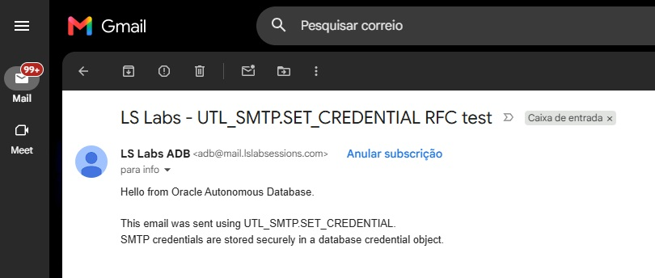
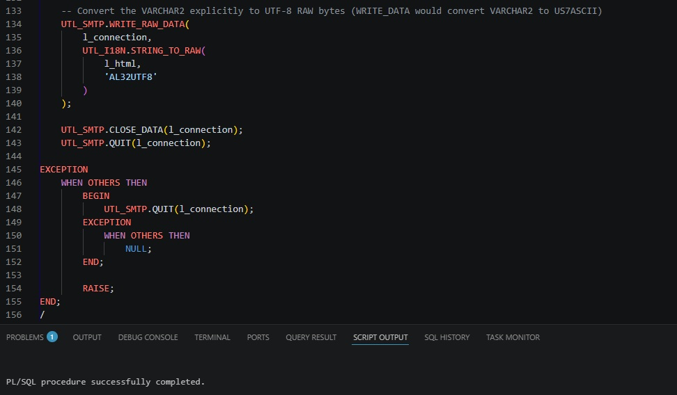
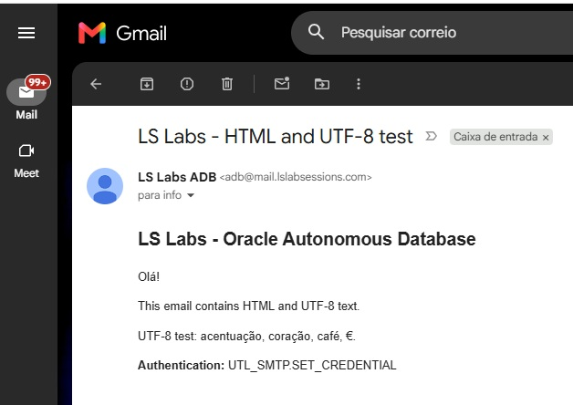
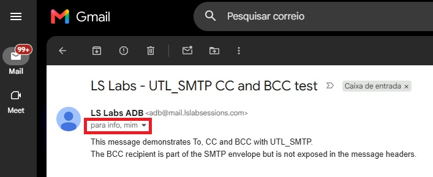
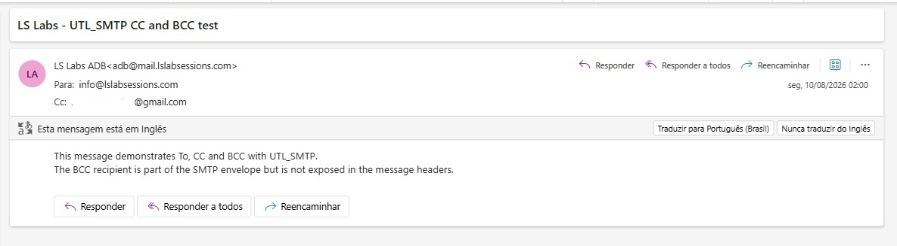
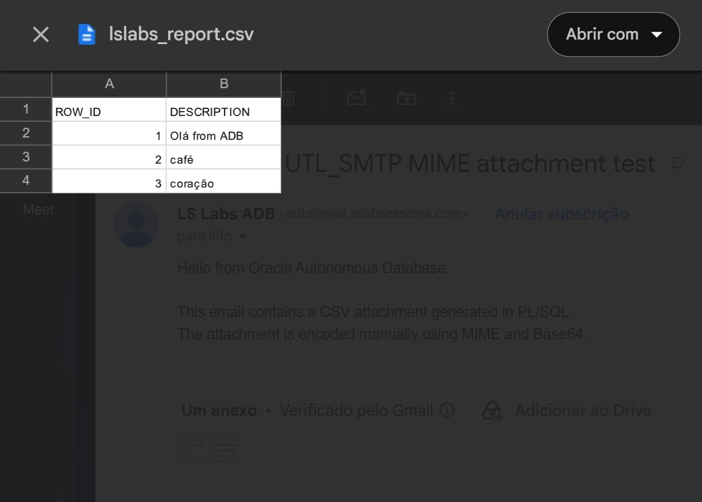

# SMTP and MIME notes

This document collects the protocol concepts demonstrated by the `UTL_SMTP` examples.

The goal is not to implement a complete email library. It is to make the layers visible enough to understand what the PL/SQL code is doing.

## SMTP conversation

A typical SMTP sequence in this project is:

```text
OPEN_CONNECTION
      ↓
EHLO
      ↓
STARTTLS
      ↓
EHLO
      ↓
AUTH or SET_CREDENTIAL
      ↓
MAIL
      ↓
RCPT
      ↓
OPEN_DATA
      ↓
WRITE_DATA / WRITE_RAW_DATA
      ↓
CLOSE_DATA
      ↓
QUIT
```

### Why EHLO is called again after STARTTLS

The initial `EHLO` discovers the server capabilities before TLS.

After `STARTTLS`, the SMTP session continues over the encrypted connection. The client sends `EHLO` again so it can obtain the capabilities available after the TLS upgrade, including authentication mechanisms.

## AUTH and SET_CREDENTIAL

`UTL_SMTP.AUTH` accepts the username and password directly:

```sql
UTL_SMTP.AUTH(
    l_connection,
    '<SMTP_USERNAME>',
    '<SMTP_PASSWORD>',
    schemes => 'PLAIN'
);
```

This can authenticate successfully, but the reusable secret reaches the PL/SQL call as a parameter.

`UTL_SMTP.SET_CREDENTIAL` instead receives the name of a database credential object:

```sql
UTL_SMTP.SET_CREDENTIAL(
    l_connection,
    'LSLABS_EMAIL_CRED',
    schemes => 'PLAIN'
);
```

Oracle documents credential objects as the safer and more convenient alternative for this Autonomous Database use case.

`PLAIN` refers to the SMTP authentication mechanism. The project performs authentication only after `STARTTLS`.

## SMTP envelope

The SMTP envelope contains the delivery instructions.

The sender is introduced with `MAIL` and each recipient is added with `RCPT`.

Conceptually:

```text
MAIL FROM:<adb@mail.lslabsessions.com>
RCPT TO:<to@example.com>
RCPT TO:<cc@example.com>
RCPT TO:<bcc@example.com>
```

`UTL_SMTP.RCPT` is called once for each actual recipient.

## RFC 5322 message headers

Inside the SMTP `DATA` section, the application writes the message itself.

Typical headers include:

```text
Date:
Message-ID:
From:
To:
Cc:
Subject:
MIME-Version:
Content-Type:
Content-Transfer-Encoding:
```

The visible `To:` and `Cc:` headers are not what causes SMTP delivery. Delivery already comes from the `RCPT` commands.

This is why BCC can work without a visible `Bcc:` header.

## BCC with UTL_SMTP

The BCC example adds the hidden recipient to the SMTP envelope:

```text
RCPT TO:<bcc@example.com>
```

but does not write:

```text
Bcc: bcc@example.com
```

into the message body sent to the other recipients.

This demonstrates the separation between delivery instructions and message headers.

## Date header

With `UTL_SMTP`, the application can build an explicit RFC-style date header.

For example:

```text
Mon, 10 Aug 2026 20:00:00 +0000
```

The lab builds the value with an English month/day representation and an explicit UTC offset instead of relying on an implicit session-dependent date string.

That control is useful because the `DBMS_CLOUD_NOTIFICATION` tests exposed a date-format observation described in `troubleshooting.md`.

## MIME

MIME allows an email message to contain multiple body parts and non-ASCII or binary content.

### multipart/mixed

Use `multipart/mixed` when independent parts belong to the same message, such as a body plus attachments.

```text
multipart/mixed
│
├── text/plain
│
└── text/csv
    Content-Disposition: attachment
```

The parts are separated by a boundary.

Example:

```text
Content-Type: multipart/mixed; boundary="MIXED_BOUNDARY"

--MIXED_BOUNDARY
Content-Type: text/plain; charset=UTF-8

Message body

--MIXED_BOUNDARY
Content-Type: text/csv; charset=UTF-8
Content-Disposition: attachment; filename="report.csv"
Content-Transfer-Encoding: base64

<Base64 data>

--MIXED_BOUNDARY--
```

The final `--` marks the closing boundary.

### multipart/alternative

Use `multipart/alternative` for different representations of the same content.

The common example is:

```text
multipart/alternative
├── text/plain
└── text/html
```

A mail client normally chooses the representation it can or prefers to display rather than showing both as separate messages.

The less rich representation normally appears first and the richer representation later.

### Nested multiparts

A message can combine both structures:

```text
multipart/mixed
│
├── multipart/alternative
│   ├── text/plain
│   └── text/html
│
└── attachment.csv
```

The outer `multipart/mixed` separates the body structure from the attachment.

The inner `multipart/alternative` separates the plain-text and HTML versions of the body.

Each multipart uses its own boundary:

```text
MIXED_BOUNDARY
ALT_BOUNDARY
```

Do not reuse the same boundary value for nested multipart levels.

## How the main body is identified

MIME does not have a special `Body:` header that marks one part as the main message body.

In a normal `multipart/mixed` email, the first inline textual part is commonly the message body and later parts marked with:

```text
Content-Disposition: attachment
```

are presented as attachments.

A body part can explicitly use:

```text
Content-Disposition: inline
```

but omitting `Content-Disposition` for a normal textual body is also common.

The body is therefore understood from the multipart structure, part order, content type, and content disposition together.

## UTF-8 and WRITE_DATA

Oracle documents that `UTL_SMTP.WRITE_DATA` converts `VARCHAR2` text to US7ASCII.

That is fine for ASCII-safe SMTP and MIME headers such as:

```text
Subject: LS Labs attachment test
Content-Type: text/csv
```

but it is not appropriate for directly writing arbitrary multibyte text such as:

```text
Olá
café
coração
€
```

For direct UTF-8 body content, the project converts text to UTF-8 bytes:

```sql
UTL_I18N.STRING_TO_RAW(
    l_text,
    'AL32UTF8'
)
```

and sends the resulting `RAW` with:

```sql
UTL_SMTP.WRITE_RAW_DATA
```

## UTF-8 and Base64 attachments

For the CSV attachment, the original text is first converted into UTF-8 bytes:

```text
café
  ↓ UTF-8
63 61 66 C3 A9
```

Those bytes are then Base64-encoded:

```text
63 61 66 C3 A9
  ↓ Base64
Y2Fmw6k=
```

The Base64 representation contains only ASCII-safe characters.

That means it can be written through `WRITE_DATA` without losing the original non-ASCII characters, because the non-ASCII bytes have already been encoded into an ASCII representation.

The receiving client performs the reverse process:

```text
Y2Fmw6k=
  ↓ Base64 decode
63 61 66 C3 A9
  ↓ charset=UTF-8
café
```

Base64 and UTF-8 solve different problems:

```text
UTF-8
    → character-to-byte encoding

Base64
    → byte-to-ASCII transport representation
```

## Base64 line length

MIME Base64 output is represented in lines no longer than 76 characters.

The attachment example therefore wraps the encoded Base64 data before sending it.

## Content-Type and Content-Disposition

These two headers have different roles.

For example:

```text
Content-Type: text/csv; charset=UTF-8
Content-Disposition: attachment; filename="report.csv"
```

`Content-Type` describes the media type and character set.

`Content-Disposition: attachment` tells the client that the part should be presented as an attachment.

A `text/plain` or `text/html` part is not automatically an attachment simply because another part uses a different `Content-Type`.

## Screenshot evidence

The following screenshots show the message-building scenarios discussed in this document.














## References

- [UTL_SMTP](https://docs.oracle.com/en/database/oracle/oracle-database/26/arpls/UTL_SMTP.html)
- [UTL_I18N](https://docs.oracle.com/en/database/oracle/oracle-database/26/arpls/UTL_I18N.html)
- [UTL_ENCODE](https://docs.oracle.com/en/database/oracle/oracle-database/26/arpls/UTL_ENCODE.html)
- [RFC 5322](https://www.rfc-editor.org/info/rfc5322/)
- [RFC 2045](https://www.rfc-editor.org/info/rfc2045/)
- [RFC 2046](https://www.rfc-editor.org/info/rfc2046/)
