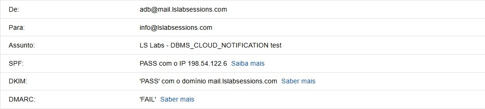
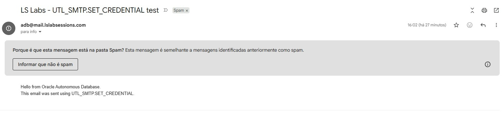
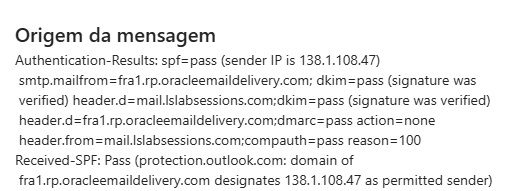
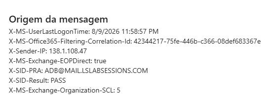
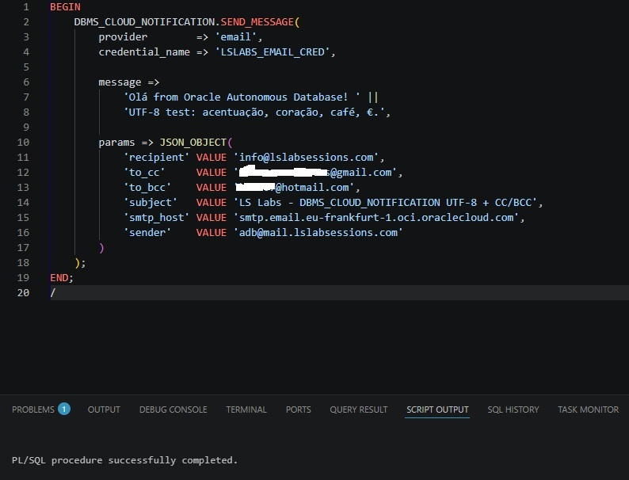
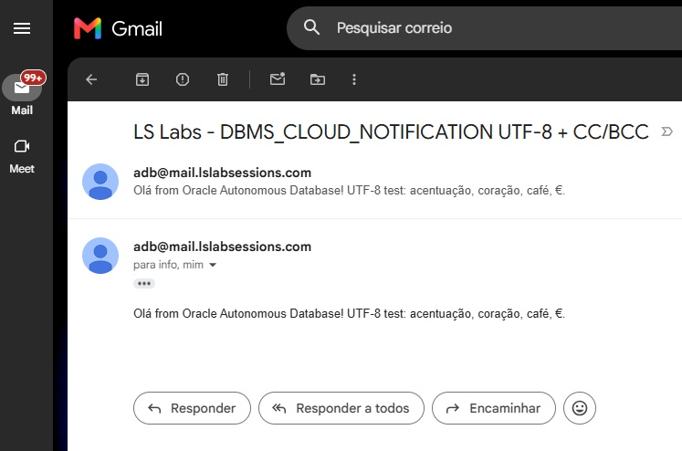

# Troubleshooting and lab observations

This document records issues encountered while building and testing the lab.

The examples are based on the actual test environment. Observed behavior is described as an observation unless it has been independently reproduced and confirmed as general product behavior.

## 1. DBMS_CLOUD_NOTIFICATION was not visible to the application schema

### Symptom

An initial attempt to use `DBMS_CLOUD_NOTIFICATION` failed with:

```text
PLS-00201
```

### Cause

The application schema did not yet have the required direct package privilege.

### Resolution

Grant the required package privileges directly to the schema that executes the code.

The repository keeps the administrative grants in:

```text
sql/000_grant_required_packages.sql
```

For example, depending on the environment and demonstrated scripts:

```sql
GRANT EXECUTE ON DBMS_CLOUD TO <APP_SCHEMA>;
GRANT EXECUTE ON DBMS_CLOUD_NOTIFICATION TO <APP_SCHEMA>;
```

Package privileges and network access are separate. A package grant does not create the SMTP network ACE.

---

## 2. SMTP network access is separate from SMTP authentication

A valid SMTP credential does not allow the database schema to reach the SMTP endpoint automatically.

The schema also needs a network Access Control Entry for:

```text
smtp.email.eu-frankfurt-1.oci.oraclecloud.com
```

on:

```text
TCP 587
```

with the SMTP privilege.

When diagnosing an SMTP failure, check both:

```text
Can the schema reach the host/port?
        ↓
Can the SMTP session authenticate?
```

Do not treat them as the same problem.

---

## 3. DBMS_CLOUD_NOTIFICATION Date header and NLS_DATE_LANGUAGE

### Observation

One `DBMS_CLOUD_NOTIFICATION.SEND_MESSAGE` test produced a message date similar to:

```text
09-AGO-2026 01:46:44
```

The database date/time itself was correct, but Gmail did not interpret the generated `Date` header correctly and displayed an incorrect date.

`AGO` came from the Portuguese session language.

### Test

After setting:

```sql
ALTER SESSION SET NLS_DATE_LANGUAGE = 'AMERICAN';
```

the generated month abbreviation changed to:

```text
AUG
```

and the date was parsed more successfully.

However, the generated value still did not include an explicit numeric time-zone offset in the tested message.

### UTL_SMTP comparison

With `UTL_SMTP`, the project generates the `Date` header explicitly, for example:

```text
Mon, 10 Aug 2026 20:00:00 +0000
```

This gives the application control over the language-independent format and time-zone value.

### Project wording

This repository treats the `DBMS_CLOUD_NOTIFICATION` date behavior as an observation from the tested environment, not as a statement that all versions or configurations generate the same value.

---

## 4. DMARC initially failed and later passed

### Initial result

Early received messages showed:

```text
SPF   PASS
DKIM  PASS
DMARC FAIL
```

### Change

A DMARC TXT record was added for the sending subdomain:

```text
_dmarc.mail.lslabsessions.com
```

with:

```text
v=DMARC1; p=none;
```

### Final result

After DNS propagation, new messages showed:

```text
SPF   PASS
DKIM  PASS
DMARC PASS
```

This is a useful example of why SMTP delivery success and domain authentication should be validated separately.

---

## 5. Forwarding changes the transport path

The address:

```text
info@lslabsessions.com
```

is forwarded by Namecheap to another mailbox.

A message sent to that address can therefore follow:

```text
ADB
  ↓
OCI Email Delivery
  ↓
Namecheap forwarding
  ↓
final mailbox
```

while a direct CC to the same final mailbox follows:

```text
ADB
  ↓
OCI Email Delivery
  ↓
final mailbox
```

The final mailbox can therefore receive two copies with different `Received`, SPF, and forwarding-related headers.

When comparing message originals, identify which path each copy followed before drawing conclusions from the headers.

---

## 6. BCC behavior observed with DBMS_CLOUD_NOTIFICATION

### Observation

During one test using:

```text
recipient
to_cc
to_bcc
```

one copy delivered to a non-BCC recipient unexpectedly displayed the BCC address in the message headers.

Another copy of the same send operation did not display the BCC address.

The environment also involved forwarding and duplicate delivery paths, so the result is not yet treated as a confirmed product issue.

### Current status

The correct next step is an isolated reproduction using three independent mailboxes:

```text
A → To
B → Cc
C → Bcc
```

with no forwarding and no mailbox appearing in more than one role.

Then inspect the original message received by A and B.

If either non-BCC copy contains the hidden recipient address in a `Bcc:` header, the behavior is reproducible and should be raised with Oracle Support.

### Repository wording

Until that independent reproduction is complete, describe this only as:

> A BCC header exposure was observed in one non-BCC copy during testing. The behavior is being retested with independent recipient mailboxes before being classified as a product issue.

Do not present it as a confirmed general limitation of `DBMS_CLOUD_NOTIFICATION` yet.

---

## 7. UTF-8 body content with UTL_SMTP

### Problem

`UTL_SMTP.WRITE_DATA` is convenient for headers and ASCII-safe text, but Oracle documents a US7ASCII conversion for `VARCHAR2` data written through this interface.

Directly sending text such as:

```text
Olá
café
coração
€
```

through the wrong path can lose or replace characters.

### Solution used by the lab

Convert the string to UTF-8 bytes:

```sql
UTL_I18N.STRING_TO_RAW(l_text, 'AL32UTF8')
```

and send the bytes with:

```sql
UTL_SMTP.WRITE_RAW_DATA
```

The MIME part declares:

```text
charset=UTF-8
```

so the receiving client knows how to interpret those bytes.

---

## 8. Base64 attachment does not lose UTF-8 characters

The CSV attachment contains UTF-8 text.

The conversion is:

```text
Unicode text
    ↓
UTF-8 bytes
    ↓
Base64 ASCII representation
```

The Base64 output is ASCII-safe, so it can be written as text during the SMTP transfer.

At the receiving side:

```text
Base64
    ↓ decode
original UTF-8 bytes
    ↓ charset=UTF-8
original text
```

Base64 does not replace UTF-8. It transports the UTF-8 bytes in an ASCII representation.

---

## 9. Message authenticated successfully but reached Junk

### Observation

A test message delivered to Outlook showed successful authentication results, including SPF, DKIM, and DMARC, but was still classified as Junk.

The message also showed a spam-confidence classification from the receiving provider.

### Interpretation

This does not mean SPF, DKIM, or DMARC failed.

Authentication and spam filtering are separate stages.

A receiving provider can consider additional signals such as:

- sender reputation;
- domain reputation;
- IP reputation;
- sending history;
- message content;
- message structure;
- recipient behavior;
- provider-specific heuristics.

### Lesson

Do not use:

```text
SPF + DKIM + DMARC = PASS
```

as proof that a message will reach the Inbox.

---

## 10. Minimal UTL_SMTP message versus a more complete message

During testing, a very minimal `UTL_SMTP` message was classified as Spam, while later messages with a more complete RFC-style structure reached the Inbox.

The later examples included explicit values such as:

```text
Date:
Message-ID:
MIME-Version:
Content-Type:
```

This is an observation, not proof that adding those headers alone caused the different classification.

Spam filtering is multi-factor, so the repository should avoid claiming a direct causal relationship.

The useful lesson is to build well-formed messages and still treat Inbox placement as a separate deliverability concern.

---

## 11. Checklist when a message does not arrive

Check the problem layer by layer.

### Database

```text
[ ] Required package privileges exist
[ ] Network ACE matches the application schema
[ ] SMTP host is correct
[ ] Port 587 is allowed
[ ] Database credential exists
```

### OCI

```text
[ ] SMTP credentials are valid
[ ] IAM identity has the required Email Delivery permission
[ ] Email Domain is configured in the intended region
[ ] DKIM is Active
[ ] Approved Sender is present
[ ] Sender address is under the approved identity/domain
```

### DNS

```text
[ ] SPF resolves
[ ] DKIM CNAME resolves
[ ] DMARC TXT resolves
```

### Message

```text
[ ] SMTP MAIL / RCPT envelope is correct
[ ] From / To / Cc headers are correct
[ ] BCC is not unintentionally exposed
[ ] Date header is parseable
[ ] MIME boundaries are correct
[ ] UTF-8 content is encoded correctly
[ ] Base64 lines are wrapped correctly
```

### Receiving provider

```text
[ ] Check Spam / Junk
[ ] Inspect original headers
[ ] Check SPF / DKIM / DMARC results
[ ] Identify whether forwarding changed the delivery path
```

## Screenshot evidence

The troubleshooting notes above are based on observations from the real lab. These screenshots preserve the most useful before/after evidence.

### DMARC before and after




### Deliverability is separate from authentication







### UTF-8 and higher-level notification tests





## References

- [Send Email on Autonomous AI Database](https://docs.oracle.com/en-us/iaas/autonomous-database-serverless/doc/smtp-send-mail.html)
- [DBMS_CLOUD_NOTIFICATION](https://docs.oracle.com/en/cloud/paas/autonomous-database/serverless/adbsb/autonomous-dbms-cloud-notification.html)
- [UTL_SMTP](https://docs.oracle.com/en/database/oracle/oracle-database/26/arpls/UTL_SMTP.html)
- [RFC 5322](https://www.rfc-editor.org/info/rfc5322/)
